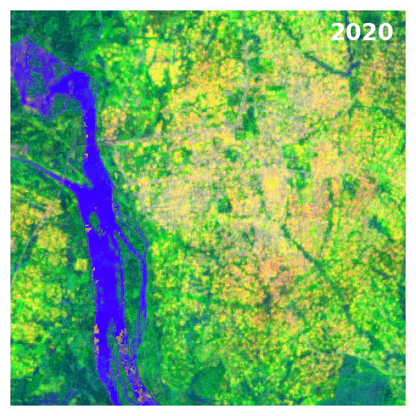

# From Pixels to Embeddings: Scaling Satellite AI with a Master-Worker Architecture

By Gijs van den Dool — LinkedIn | GitHub

Satellite imagery has been used to map the world since the launch of Landsat 1 in 1972. However, simply assigning each pixel a single label is no longer sufficient. Foundation models like TESSERA offer a new approach. Instead of assigning a fixed class to each pixel, they create detailed 128-dimensional embeddings that capture the full spectral-temporal signature of each location.

While foundation models can be trained on many different datasets—such as the Landsat time series for multi-decadal observation—modern systems like TESSERA leverage both Sentinel-1 SAR and Sentinel-2 optical imagery. This multi-modal combination provides higher spatial resolution, more frequent revisits, and cloud-free coverage, significantly improving the quality of embeddings in difficult environments.

Turning these rich, multi-source datasets into consistent, high-quality embeddings across large regions is a game-changer: these embeddings can power many downstream tasks—such as land-cover analysis, change detection, and agricultural monitoring—with minimal fine-tuning and without retraining the core model.

The challenge is getting there at scale.

## Customising TESSERA's framework

TESSERA is an open-source foundation model developed at the University of Cambridge (github.com/ucam-eo/tessera). The team has done an exceptional job documenting and structuring the repository: the codebase is clean, preprocessing scripts are well-parameterised, and the inference pipeline is logically separated from data preparation.

The real challenge isn't the code—it’s the compute context. Without a dedicated HPC environment, running the full pipeline in a single pass can quickly exhaust memory and storage when processing multi-year satellite stacks. While the Cambridge team is working to provide these embeddings as a 'global carpet' (Model-as-Data), the sheer volume of petabytes means planetary-scale rollouts take time.

My solution was to stage the pipeline into discrete, self-contained functions called within a double loop over areas and years. This transforms a potentially fragile monolithic script into a controllable, resumable process: if a single year or tile fails, only that combination needs to be rerun.

To orchestrate this, I built a Master-Worker architecture within Google Colab. The 'Master' notebook owns configuration and orchestration, defining the areas, years, and processing schedule. The Worker notebook is a library of modular functions that are executed in the same Google Colab kernel, so all state is shared without file I/O across notebooks.

## The Pipeline: Fifteen Steps

The pipeline divides into two phases: seven configuration steps that run once per session, and eight processing steps that execute inside the double loop for every area-year combination.

### Phase 1: Configuration (Steps 1–7)
Phase 1 establishes a fully reproducible execution environment by connecting to persistent storage, retrieving the required codebase, installing dependencies, and standardising paths and permissions. The model is also prepared for efficient inference by localising checkpoints and applying targeted patches. These steps ensure that all subsequent processing runs reliably within the Colab runtime.

* **Step 1: Preparing the Google Colab environment.** This step connects the Colab runtime to persistent storage, where the repository, checkpoints, and final outputs are stored. Google Colab Pro with an L4 GPU and high-RAM runtime is used to align with the requirements specified by the TESSERA team.
* **Step 2: Clone the TESSERA repository.** The specified branch is pulled from GitHub into the Drive-mounted directory, making preprocessing and inference scripts available to the pipeline. If the repository is already present, the active branch is verified, and the clone step is skipped.
* **Step 3: Install dependencies.** All required Python packages, including rasterio, xarray, stackstac, pyproj, pystac-client, planetary-computer, and others, are installed into the Colab environment. This step is separated from the import step to ensure that packages are present before any module-level imports are attempted.
* **Step 4: Configure project paths.** All working directories, including data, temporary scratch space, checkpoints, and output, are resolved into a single configuration object that is passed through the pipeline. Local scratch space (/content/) is used for intermediate input and output, while only final outputs are written back to Google Drive. The additional personal storage capacity is a key reason for selecting the Colab and Google Drive configuration.
* **Step 5: Localise the model checkpoint.** The most recent TESSERA model weights (approximately 7.5 GB) are collected and stored on a personal Google Drive. The selected checkpoint is then copied to local runtime storage. This approach avoids path issues caused by spaces in filenames, ensures the pipeline uses the latest or appropriate model, and accelerates checkpoint loading during inference.
* **Step 6: Patch preprocessing scripts.** Two targeted patches were applied to the TESSERA repository. The first updates the inference launch script to use the correct Python executable path for the current Colab environment. The second adds cloud class 10 (thin cirrus) to the Sentinel-2 invalid-pixel mask. Thin cirrus clouds (SCL class 10) are semi-transparent but are often masked in optical processing because they can distort surface reflectance and derived indices. In regions such as West Africa, where cloud cover is common, removing these pixels improves composite and analysis quality but reduces temporal coverage in scenes with less than 20% overall cloud cover.
* **Step 7: Set file permissions.** The Rust-compiled stacking binaries and shell scripts are marked as executable. This step is required for every new Colab session because the Drive-mounted filesystem does not preserve Unix permissions across sessions.

### Phase 2: Main Processing Loop (Steps 8–15)
Phase 2 runs for each area and year, combining optical and radar data to create georeferenced embeddings for analysis. The steps include making a region of interest, downloading Sentinel-1 and Sentinel-2 images, stacking and patching the data, running model inference, and exporting the results. Storage is managed efficiently in local scratch space. This method keeps processing consistent and repeatable across different locations and times. All functions match scripts found in the GitHub repository.

* **Step 8: Generate Region of Interest (ROI).** The central coordinates and tile size for each area are converted into a georeferenced single-band GeoTIFF using the correct UTM projection. This ROI sets the boundaries for all later spatial steps and the final output. To keep memory use reasonable and processing stable, a 5×5 km area (500×500 cells, like the TESSERA chip) is used by default. This usually takes about 8 minutes in the chosen Colab environment.
* **Step 9: Download Sentinel-2.** The Microsoft Planetary Computer STAC catalogue is searched for Sentinel-2 (S2) images with low cloud cover for the ROI and year. The images are saved directly to the local scratch space. By default, only scenes with up to 20% cloud cover are included, which helps avoid very cloudy images in overcast areas. While TESSERA can handle some clouds, using mostly clear images helps each patch produce high-quality embeddings, especially in cloudy regions.
* **Step 10: Download Sentinel-1.** The same catalogue is used to get SAR backscatter data from the Microsoft Planetary Computer Sentinel-1-rtc collection. Sentinel-1 (S1) images are not affected by clouds, so they are a useful addition to optical images in tough weather. The SAR images from MPC are already terrain-corrected, so topographic effects are handled during preprocessing. Both ascending and descending orbits are requested, but for this area, only ascending images are available. This may slightly affect data quality due to viewing angles and terrain, but about 30 images per year still provide a strong basis for analysis.
* **Step 11: Stack.** The TESSERA Rust-compiled stackers for S1 and S2 are executed in parallel, consolidating the downloaded GeoTIFFs into numpy arrays organised by band, date, and orbit state. The resulting stacked arrays are stored entirely in local scratch space.
* **Step 12: Retile.** The stacked arrays are divided into 40×40 pixel patches for inference. A 5 km tile at 10 m resolution yields 169 patches. The retiler also generates a small ROI mask for each patch, which is subsequently used to address edge cases at tile boundaries.
* **Step 13: Inference.** The TESSERA model is applied to all patches using the localised checkpoint. This step is computationally intensive and requires a GPU runtime (L4 or A100). Processing 169 patches typically takes 6 to 10 minutes. Each patch produces a 40×40×128 embedding array.
* **Step 14: Stitch and export.** The 169 patch embeddings are combined into one 500×500×128 spatial array, georeferenced to the original ROI. This array is saved as a GeoTIFF in the area's output folder on Drive. The 128 MB file works with standard GIS tools and can be used by any downstream classifier.
* **Step 15: Cleanup.** All temporary files, such as downloads, stacks, patches, and representations, are deleted from local scratch space to free up storage before starting the next area and year. The final outputs on Drive are not affected.

## Results: Six Years of Embeddings Over a Single Area

To validate the pipeline, embeddings were generated for the same 5×5 km area across six consecutive years (2020–2025). Each year produces a 500×500×128 GeoTIFF — where every pixel encodes the full spectral-temporal signature of that location across a year of Sentinel-1 and Sentinel-2 acquisitions.

To visualise the 128-dimensional output, PCA was fitted once across all years combined and used to reduce each year to three components, mapped to RGB. Fitting PCA globally ensures that colours are comparable across years — a shift in hue reflects a genuine change in the landscape, not a statistical artefact.

The animation reveals an immediate and interpretable structure. The river running through the western edge of the tile appears as a stable deep blue across all six years — water has a consistent spectral-temporal signature that the model encodes reliably without any supervision. The urban area to the east shifts colour noticeably between years, reflecting real changes in the built environment and surrounding land use. The agricultural mosaic shows fine texture distinguishing crop types, fallow cycles, and agroforestry patterns.

No classifier was applied. No labels were used. The structure in the image emerges entirely from the learned embeddings — which is precisely the point.

**Figure 1. PCA-reduced TESSERA embeddings for the Soubre test tile (2020–2025). PCA was fitted once across all six years to ensure a consistent colour reference frame. No classifier or labels were applied.**

The challenge of **scale** persists; however, this modular architecture will enable the creation of deep, systematic views and contribute to a better year-over-year understanding of our changing planet.

The acquisition table below illustrates this directly. For this test area — deliberately chosen in a region with persistent cloud cover — only 2023 has enough cloud-free Sentinel-2 scenes to meet the minimum threshold for meaningful embeddings. In most years, clear acquisitions cluster in the dry season, meaning that year-over-year comparisons carry an inherent seasonal bias that cannot be resolved without denser temporal coverage.

**Table 1. Cloud-filtered Sentinel-2 acquisition dates for the Soubre test tile (max. 20% cloud cover, 2020–2025)**
|  Year | Count | Acquisition Dates |
|------|-------|-------------------|
| 2020 | 4 | 2020-01-03, 2020-01-13, 2020-02-07, 2020-05-02 |
| 2021 | 2 | 2021-02-06, 2021-12-23 |
| 2022 | 4 | 2022-01-22, 2022-03-03, 2022-12-18, 2022-12-28 |
| 2023 | 7 | 2023-01-02, 2023-01-07, 2023-04-02, 2023-05-07, 2023-12-13, 2023-12-18, 2023-12-23 |
| 2024 | 3 | 2024-01-27, 2024-02-06, 2024-03-27 |
| 2025 | 2 | 2025-01-26, 2025-03-27 |

The threshold for cloud presence in a scene is set to 20%. For traditional machine learning tasks, this is already considered high, but the TESSERA documentation suggests accepting up to 90–100% cloud cover, relying on pixel-level SCL masking to filter out individual cloudy pixels within each scene. In principle, relaxing the threshold would increase temporal coverage and reduce seasonal sampling bias. However, in West Africa, cloud cover during the rainy season is not just dense but persistent — accompanied by shade, haze, and atmospheric scattering that degrade surface reflectance even in nominally cloud-free pixels. In this context, lowering the threshold may increase scene count without meaningfully improving embedding quality, and the conservative 20% filter is retained as the safer default.

## Outlook

My primary objective is to use these notebooks to build a regional embedding archive spanning various areas and years. While the official global TESSERA outputs are being produced and validated by the Cambridge team, this 'on-demand' approach allows projects to train downstream Earth observation models early — without the need for high-performance computing (HPC) or waiting for global rollouts.

The architecture is designed for easy expansion:
* **Scalability:** Adding a new study area is as simple as changing a single coordinate setting.
* **Flexibility:** Every step—from cloud-cover thresholds to SAR orbit selection—can be adjusted independently.
* **Throughput:** The double-loop structure supports parallel execution across multiple Colab sessions for users processing entire countries.

By staging the pipeline this way, we move from 'experimental scripts' to a production-ready data factory.

The notebooks are publicly available at github.com/GvdDool. I welcome feedback and contributions, and I look forward to seeing how others apply these 128-dimensional signatures to their own environmental challenges!

#EarthObservation #TESSERA #OpenScience #RemoteSensing #MachineLearning #Sustainability

| Year | 5 | 10 | 15 | 20 | 25 | 30 | 35 | 40 | 45 | 50 | 55 | 60 | 65 | 70 | 75 | 80 | 85 | 90 | 95 | 100 |
|------|---|----|----|----|----|----|----|----|----|----|----|----|----|----|----|----|----|----|----|-----|
| 2020 | · | · | · | · | · | **8** | 10 | 13 | 20 | 24 | 25 | 34 | 37 | 41 | 44 | 49 | 50 | 55 | 61 | 72 |
| 2021 | · | · | · | · | · | **10** | 12 | 17 | 20 | 23 | 25 | 28 | 31 | 34 | 36 | 40 | 42 | 50 | 56 | 66 |
| 2022 | · | · | · | · | **7** | 8 | 11 | 13 | 14 | 17 | 17 | 19 | 21 | 23 | 24 | 28 | 32 | 42 | 52 | 71 |
| 2023 | · | · | · | **7** | 8 | 8 | 11 | 13 | 16 | 18 | 21 | 25 | 27 | 35 | 38 | 44 | 48 | 53 | 57 | 73 |
| 2024 | · | · | · | · | · | **7** | 8 | 9 | 15 | 18 | 20 | 20 | 22 | 28 | 31 | 37 | 38 | 42 | 45 | 68 |
| 2025 | · | · | · | · | · | **7** | 9 | 11 | 14 | 15 | 17 | 18 | 25 | 31 | 38 | 40 | 46 | 55 | 62 | 92 |
